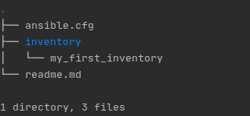
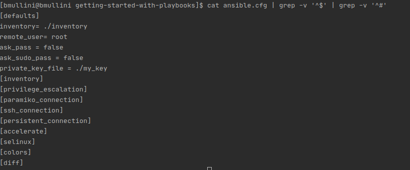
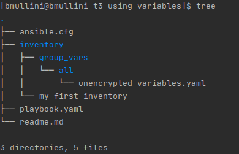
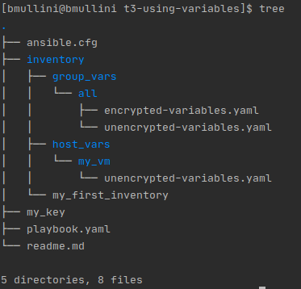
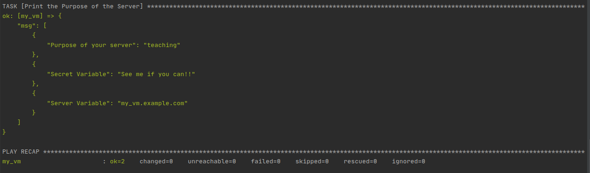

# Working with Ansible Variables

Last updated: 06.16.2020

## Purpose

The purpose of this document is to show how to work with Ansible variables.

## Prerequisites

Please read the instructions in the [readme.md](../t1-getting-started/readme.md)
to have an understanding of how to set up your Ansible environment
and run adhoc Ansible commands before continuing.

Please setup your environment if you don't have access to Ansible by
following the instructions [here](../t1-getting-started/readme.md).

A working knowledge of Ansible playbooks.  If you haven't, please go
[here](../t2-using-playbooks) to learn more.

### A Running VM

You can create your VM anyway you want.

One option is to use Terraform to create an Amazon EC2 instance (VM).
I have instructions on setting up your environment in the
[terraform for beginners git repo](https://github.com/bretmullinix/terraform-for-beginners/tree/master/t1-getting-started).
In the repo be sure to follow the instructions in the
[readme.md](https://github.com/bretmullinix/terraform-for-beginners/tree/master/t1-getting-started/readme.md)
and the instructions in the
[ about how to inject your private key into an ec2 instance](https://github.com/bretmullinix/terraform-for-beginners/tree/master/t3-injecting-your-ssh-key-into-ec2-instance).


### Instructions

1. Open up a terminal.
1. mkdir t3-using-variables
1. cd t3-using-variables
1. Copy the content [here](../t1-getting-started) to the current directory.
1. Run `tree` in your terminal.  You should see the following output:

    

    The output of the **tree** command is the following:
    
    - **ansible.cfg**: The ansible configuration file used to configure
    the location of your inventory and other preferences for your playbook(s)
    in the current directory and below.
    - **inventory**: The directory contains all the inventory files.
     The inventory files define the servers and/or groups
     that can be a target for your playbook(s)
    
1.  Run `cat ansible.cfg | grep -v '^$' | grep -v '^#'`.  You will get
the following output:

    

    The active configuration is explained below:
    
      - **inventory** = Currently, the value specifies the inventory directory to
        find all the inventory files.  If you had more than one
        inventory file, you could add them to this directory and ansible
        would allow you to specify any server or group(s)
        listed in any of the files.
        
      - **remote_user** = The user on the remote machine you
        plan to login as using ssh.
        
      - **ask_user** = If set to true, before you run an ansible command(s),
        the ansible program will prompt you for a password.  Since we are going to
        be using a private key file, we won't need a password prompt on ssh
        login.
        
      - **ask_sudo_pass** = If set to true, before any privileged ansible
        command(s) can be run, the ansible program
        will prompt you for a password. If your user requires a
        password when running a **sudo** command, 
        you will need to set this to true.
        
      - **private_key_file** = The private key file that is used to login using
        ssh.
      
      - **become** = If set to true, the environment is run in privileged mode.
      
      - **become_method** = The method to become the privileged user.  In
      this case we are using the **sudo** method.
      
      - **become_user** = The privileged user to run as.  In this case
      we are using the **root** user.
      
      - **become_ask_pass** = If set to true, when running Ansible, the
      Ansible program will prompt you for the privileged user's password.  In our
      case the login user does not require a password to change to the
      privileged user.

1. Copy your **my_key** private key file for your vm to this directory.
1. Edit the **./inventory/my_first_inventory** file and change the ip to
correspond to the ip of your VM.
1. Create a file called **playbook.yaml**
1. Add the following content to the file:

    ```yaml
   ---
   - name: Playbook with Variables
      hosts: all
      tasks:
      - name: Print the Purpose of the Server
        debug:
          msg:
            - Purpose of your server:  "{{ var_server_purpose }}"
   ```
   
   The playbook is doing the following:
   
   1. Uses the **all** group of servers defined
   in the **./inventory/my_first_inventory** file.
   
   1. Prints out a message to the console using the **debug** task.
   
   1. Prints out a message containing the purpose of the server.
   
   1.  Uses a variable called **var_server_purpose** to get the purpose
   of the server.  The variable is going to be defined in the next steps.
   
   :warning: Spaces matter in playbooks.  All child tags in `yaml` must
   be indented by 2 spaces from the parent tag.
   
   :star: You can get a definition and example of using an Ansible module
   by running **ansible-doc** [module_name].  Replacing the [module_name]
   with an actual module.  An example is `ansible-doc debug`.

1. cd inventory
1. mkdir **group-vars**
1. cd **group-vars**
1. mkdir **all**
1. Create the file called **unencrypted-variables.yaml**
1. Add the following content:

    ```yaml
    ---
    var_server_purpose: "teaching"
   ```

1. Save the file.

1. cd ../../..

1. Run `tree`.  The output is below:

    
    
    The output above shows we have the **unencrypted-variables.yaml** in
    the **group_vars** directory.  The **group_vars** is at the same
    level in the tree as your inventory file(s).  The **group_vars**
    defines child folders or files that represent variables for a
    group in your inventory.  In our case, we added an **all** folder
    which represents variables declared for the **all** inventory group.
    Inside the **all** folder, we defined the **unencrypted-variables.yaml**
    and placed the **var_server_purpose** definition in the file.  By adding
    the variable here, we have defined the variable for the **all** group.

1. Run ` ansible-playbook --syntax-check playbook.yaml` to make
sure your ansible playbook is syntactically correct.  You may add **-v**,
**-vv**, **-vvv**, or **-vvvv** to show more and more detailed output for
debugging. 

    :eyes: If you get an error, make sure your spacing is correct in
    the playbook.  All child tags must be indented by 2 spaces.

1. Run `ansible-playbook playbook.yaml` to run the playbook.  The
playbook will check the **id** of the logged in user on the server(s) and then
install **httpd** if it does not exist.  You may add **-v**, **-vv**, **-vvv**,
or **-vvvv** to show more and more detailed output for debugging.

1. cd group_vars/all
1. vi encrypted-variables.yaml
1. Add the following content:

    ```yaml
    ---
    var_secret: See me if you can!!
    ```
1. Save the file

1. Run `ansible-vault encrypt encrypted-variables.yaml`.

1. You will be asked a vault password and asked to validate it.

    :warning: Remember your vault password.  You will need it
    every time you run your playbook.

1. cd ../../..

1. vi playbook.yaml
1. On the last line add the following content.
The line should be indented to line up with the line above:

    ```yaml
           - Secret Variable: "{{ var_secret }}"
   ```
  
1. Run ` ansible-playbook --syntax-check --ask-vault-pass playbook.yaml` 

    The argument **--ask-vault-pass** tells Ansible to ask for your vault
    secret for any encrypted variables.  Enter your vault password you
    entered when you encrypted the **encrypted-variables.yaml** file.

1. When you receive no errors, run
`ansible-playbook --ask-vault-pass playbook.yaml`

1. cd inventory
1. mkdir host_vars
1. cd host_vars
1. mkdir my_vm
1. vi unencrypted-variables.yaml
1. Add the following to the file:

    ```yaml
    ---
    var_host_name: "my_vm.example.com"
    ```

1. cd ../../..
1. Run the command `tree`

    Below is the output of **tree**:
    
    
    
    The **host-vars** directory contains all the server
    variables.  Within the **host-vars** directory, a
    folder can be named for each server.  In the **my_vm**
    folder, we have all the variables for the server called
    **my_vm**.
    
1.  vi playbook.yaml
1.  Add the following line to output a host variable:

    ```yaml
        - Server Variable: "{{ var_host_name }}"
    ```  

1. Run `ansible-playbook --syntax-check --ask-vault-pass playbook.yaml` 

    We run the above command every time we add new content to check the
    syntax of our changes to the playbook.

1. When you receive no errors, run
`ansible-playbook --ask-vault-pass playbook.yaml`

    The output should be similar to the following:
    
    

All files created in the tutorial are in the current directory.