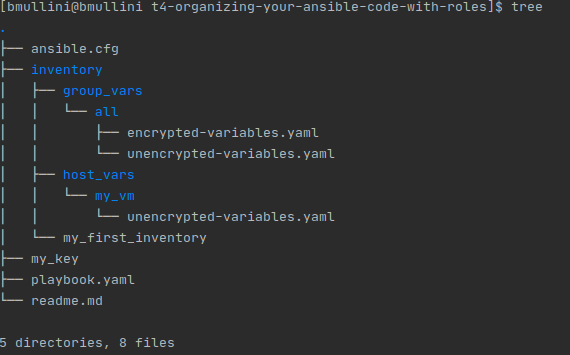

# Working with Ansible Roles

Last updated: 06.18.2020

## Purpose

The purpose of this document is to show how to work with Ansible roles.
Ansible Roles allow you to organize and separate your playbooks and variables
so that maintenance does not become a burden over time.  Maintainers need
only to look at the Ansible Role documentation and standardized
structure to figure out how an application works.  
Also, most of the standardized structure can be created for the Ansible developer
using **Ansible Galaxy**.  An Ansible developer just has to execute one command
to form the initial standardized Ansible Role.  Then, the developer just modifies
the section of the structure needed to complete the Ansible Role. 

## Prerequisites

Please read the instructions in the [readme.md](../t1-getting-started/readme.md)
to have an understanding of how to set up your Ansible environment
and run adhoc Ansible commands before continuing.

Please setup your environment if you don't have access to Ansible by
following the instructions [here](../t1-getting-started/readme.md).

A working knowledge of Ansible playbooks.  If you haven't, please go
[here](../t2-using-playbooks) to learn more.

A working knowledge of Ansible variables.  If you haven't please go
[here](../t3-using-variables) to learn more.

### A Running VM

You can create your VM anyway you want.

One option is to use Terraform to create an Amazon EC2 instance (VM).
I have instructions on setting up your environment in the
[terraform for beginners git repo](https://github.com/bretmullinix/terraform-for-beginners/tree/master/t1-getting-started).
In the repo be sure to follow the instructions in the
[readme.md](https://github.com/bretmullinix/terraform-for-beginners/tree/master/t1-getting-started/readme.md)
and the instructions in the
[ about how to inject your private key into an ec2 instance](https://github.com/bretmullinix/terraform-for-beginners/tree/master/t3-injecting-your-ssh-key-into-ec2-instance).

### Instructions

1. Open up a terminal.
1. mkdir t4-organizing-your-ansible-code-with-roles
1. cd t4-organizing-your-ansible-code-with-roles
1. Copy the content [here](../t3-using-variables) to the current directory.
1. Run `tree` in your terminal.  You should see the following output:

    

    The output of the **tree** command is the following:
    
    - **ansible.cfg**: The ansible configuration file used to configure
    the location of your inventory and other preferences for your playbook(s)
    in the current directory and below.
    
    - **inventory**: The directory contains all the inventory files.
     The inventory files define the servers and/or groups
     that can be a target for your playbook(s)
     
    - **group_vars**: The directory contains all the **group** variables
    defined in all the inventory files.
    
    - **host_vars**: The directory contains all the **server** variables
    defined in all the inventory files.
    
1.  Run `cat ansible.cfg | grep -v '^$' | grep -v '^#'`.  You will get
the following output:

    

    The active configuration is explained below:
    
      - **inventory** = Currently, the value specifies the inventory directory to
        find all the inventory files.  If you had more than one
        inventory file, you could add them to this directory and ansible
        would allow you to specify any server or group(s)
        listed in any of the files.
        
      - **remote_user** = The user on the remote machine you
        plan to login as using ssh.
        
      - **ask_user** = If set to true, before you run an ansible command(s),
        the ansible program will prompt you for a password.  Since we are going to
        be using a private key file, we won't need a password prompt on ssh
        login.
        
      - **ask_sudo_pass** = If set to true, before any privileged ansible
        command(s) can be run, the ansible program
        will prompt you for a password. If your user requires a
        password when running a **sudo** command, 
        you will need to set this to true.
        
      - **private_key_file** = The private key file that is used to login using
        ssh.
      
      - **become** = If set to true, the environment is run in privileged mode.
      
      - **become_method** = The method to become the privileged user.  In
      this case we are using the **sudo** method.
      
      - **become_user** = The privileged user to run as.  In this case
      we are using the **root** user.
      
      - **become_ask_pass** = If set to true, when running Ansible, the
      Ansible program will prompt you for the privileged user's password.  In our
      case the login user does not require a password to change to the
      privileged user.

1. Copy your **my_key** private key file for your vm to this directory.

1. Edit the **./inventory/my_first_inventory** file and change the ip to
correspond to the ip of your VM.

#### Adding the new Ansible Role
1. Run `ansible-galaxy init my-first-role`
1. Run `tree my-first-role`

    The following shows the results of the above command:
    
    

    1. **default** = The folder contains all the **variables** that are most
    likely to be changed by an Ansible developer that use the role.  The
    folder can have many files that are combined when the role is executed.
    
    1. **files** = The folder contains any files that the role needs
    to execute.  For example, the role runs a module that
    transfers a file to the target server(s).  The **file to be
    transferred** would exist in the **files** folder.
    
    1. **handlers** = The folder contains the Ansible modules that run
    after an execution of the role.  By default, the **handlers**
    only execute after a **successful** execution of the role, but can
    be changed to execute regardless of **success**.
    
    1. **meta** = The folder contains information on the **dependent** roles
    needed for the role to run and any other information the users or systems
    need to know about the role.
    
    1. **tasks** = The folder containing the **main.yml** file.  By default, the
    **main.yml** contains all the **modules** that are run when the role is
    executed.  After the **main.yml** is successfully executed, any **handlers**
    are executed.
    
    1. **templates** = The folder contains **Jinja** templates.  The templates
    are files that contain Ansible logic.  During the role
    execution, the logic produces a **generated** file that
    is used in the execution of the modules.  An example of a **template**
    file is one with logic that outputs a file based on variables populated
    during the execution of a module.
    
    1. **tests** = The folder contains tests that can be run to validate
    that the role will execute as is intended.  The default inventory and
    tests can be run, or you can use something a little more powerful.  One
    powerful framework is **Ansible Molecule**. **Ansible Molecule**
    can be used to generate and run these tests in different environments.
    For instance, Ansible **molecule** can spin up a **Docker** container
    and run your role against the **Docker** container with very little setup.
    
    1. **vars**  = The folder contains all the **variables** used by
    the role that are not likely to be changed by the developers.  The
    folder can have many files that are combined when the role is executed.

#### :construction: Under construction....